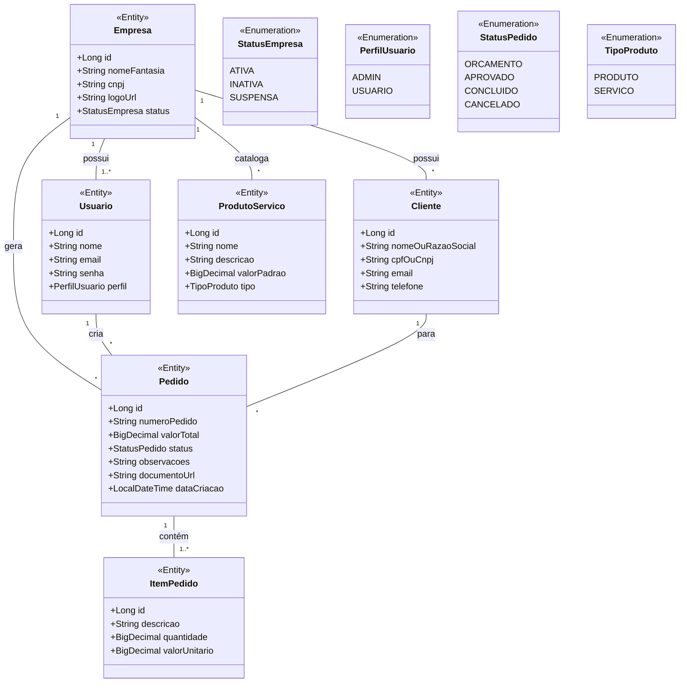

```mermaid
classDiagram
    class Empresa {
        <<Entity>>
        +Long id
        +String nomeFantasia
        +String cnpj
        +String logoUrl
        +StatusEmpresa status
    }

    class Usuario {
        <<Entity>>
        +Long id
        +String nome
        +String email
        +String senha
        +PerfilUsuario perfil
    }

    class Cliente {
        <<Entity>>
        +Long id
        +String nomeOuRazaoSocial
        +String cpfOuCnpj
        +String email
        +String telefone
    }

    class Pedido {
        <<Entity>>
        +Long id
        +String numeroPedido
        +BigDecimal valorTotal
        +StatusPedido status
        +String observacoes
        +String documentoUrl
        +LocalDateTime dataCriacao
    }

    class ItemPedido {
        <<Entity>>
        +Long id
        +String descricao
        +BigDecimal quantidade
        +BigDecimal valorUnitario
    }

    class ProdutoServico {
        <<Entity>>
        +Long id
        +String nome
        +String descricao
        +BigDecimal valorPadrao
        +TipoProduto tipo
    }

    class StatusEmpresa {
        <<Enumeration>>
        ATIVA
        INATIVA
        SUSPENSA
    }
    class PerfilUsuario {
        <<Enumeration>>
        ADMIN
        USUARIO
    }
    class StatusPedido {
        <<Enumeration>>
        ORCAMENTO
        APROVADO
        CONCLUIDO
        CANCELADO
    }
    class TipoProduto {
        <<Enumeration>>
        PRODUTO
        SERVICO
    }

    Empresa "1" -- "1..*" Usuario : possui
    Empresa "1" -- "*" Cliente : possui
    Empresa "1" -- "*" Pedido : gera
    Empresa "1" -- "*" ProdutoServico : cataloga

    Usuario "1" -- "*" Pedido : cria
    Cliente "1" -- "*" Pedido : para

    Pedido "1" -- "1..*" ItemPedido : contém
```